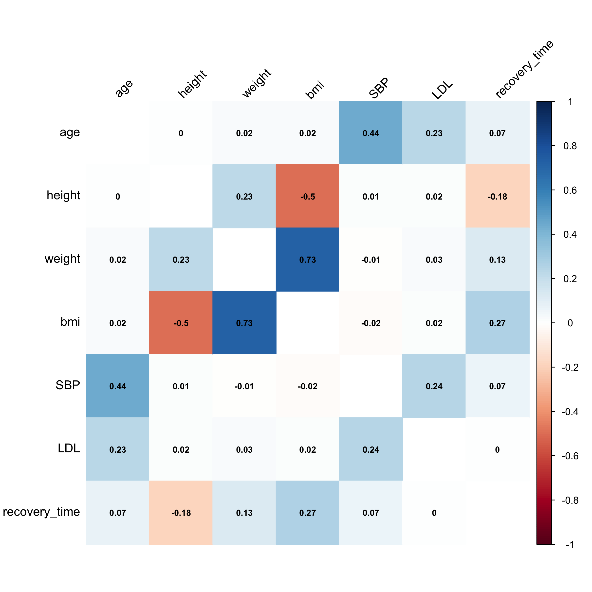

---
title: "Midterm Project" 
author: "Yiying Wu, Tingyi Li, Yvonne Chen"
output:
  pdf_document:
header-includes:
- \usepackage{fancyhdr}
- \usepackage{lipsum}
- \pagestyle{fancy}
- \fancyhead[L]{Data Science 2 Midterm}
- \fancyhead[R]{Yiying Wu, Tingyi Li, Yvonne Chen}
- \fancypagestyle{plain}{\pagestyle{fancy}}
--- 

```{r setup, include=FALSE}
knitr::opts_chunk$set(echo = FALSE, message = FALSE, warning = FALSE)
```
```{r}
library(tidyverse)
library(corrplot)
library(gtsummary)

## Input dataset
load("./recovery.RData")

## recode categorical data
dat <-dat %>% 
  mutate(
    ## gender
    male=gender,
    ## race
    race=relevel(as.factor(race), ref ="1"),
    ## smoking
    smoking=relevel(as.factor(smoking), ref ="0"),
    ## study
    study=relevel(as.factor(study), ref ="A")
  )
```


## Exploratory analysis and data visualization
```{r}
summ_dat<-dat%>%
  select(-id,-male)%>%
  mutate(
    gender = factor(case_when(
      gender == "1" ~ "female",  
      gender == "0" ~ "male"),
      levels = c("male", "female")
    ),
    race= factor(case_when(
      race == "1" ~ "White",  
      race == "2" ~ "Asian",
      race == "3" ~ "Black",
      race == "4" ~ "Hispanic"),
      levels = c("White", "Asian","Black","Hispanic")
    ),
    smoking=factor(case_when(
      smoking == "0" ~ "Never smoked",  
      smoking == "1" ~ "Former smoker",
      smoking == "2" ~ "Current smoker"),
      levels = c("Never smoked", "Former smoker","Current smoker")
    ),
    hypertension=factor(case_when(
      hypertension == "0" ~ "No",  
      hypertension == "1" ~ "Yes"),
      levels = c("No", "Yes")
    ),
    diabetes=factor(case_when(
      diabetes == "0" ~ "No",  
      diabetes == "1" ~ "Yes"),
      levels = c("No", "Yes")
    ),
    vaccine=factor(case_when(
      vaccine == "0" ~ "Not vaccinated",  
      vaccine == "1" ~ "Vaccinated"),
      levels = c("Not vaccinated", "Vaccinated")
    ),
    severity=factor(case_when(
      severity == "0" ~ "Not severe",  
      severity == "1" ~ "Severe"),
      levels = c("Not severe", "Severe")
    )
    )

summ_dat %>% 
  tbl_summary() %>% 
  bold_labels()%>%
  as_gt(include = everything()) %>%
  gt::tab_header("Table 1: Summary of Dataset")
```

The table provides a summary of health-related data for 3,000 individuals. The median age is 60, with a balanced gender split. The majority are White (66%), with smaller proportions of other races. Most have never smoked (61%), and the median BMI suggests a tendency toward overweight. Hypertension affects half of the participants, and 60% are vaccinated. The prevalence of severe health conditions is low (11%), and most individuals are part of Study A (67%). Recovery time averages at 39 days.

```{r,echo=FALSE,out.width='60%',out.height='60%',fig.align='center', fig.cap="Correlation matrix of numerical variables."}

```

The figure is a heatmap of a correlation matrix displaying the relationships between numerical health-related variables such as age, height, weight, BMI, blood pressure, cholesterol levels, and recovery time. Blue indicates positive correlations, red shows negative ones, and the intensity signifies the strength. Strong correlations are observed between weight and BMI.

## Model training

The **models** used include:

- Multivariate Adaptive Regression Splines (MARS)
- Generalized Additive Model (GAM)
- Lasso Regression
- Elastic Net Regression
- Principal Components Regression (PCR)

The dataset was partitioned into training (80%) and test (20%) sets to prepare for the model training procedure. A consistent seed was set for reproducibility (`set.seed(666)`). The training procedure involved tuning models using cross-validation with 10 folds, as controlled by the `trainControl` function in R.

**Assumptions** for these models:

- MARS assumes that relationships between predictors and the response are nonlinear and can have interactions.
- GAM assumes that the relationship can be captured by smoothing functions, allowing for non-linearity.
- Lasso and Elastic Net assume sparsity, where some coefficients can shrink to zero, implying some features do not contribute to the model.
- PCR assumes that the principal components of the predictors are linearly related to the response variable.

The **training** of each model involved searching for optimal parameters:

- MARS models were tuned over degrees of interactions and the number of terms to prune. The selected nprune is 5, and the degree is 2.
- GAM was trained without specifying the basis dimension for smooth terms, allowing the model to select them automatically. All predictors are included in the model. The nonlinear terms included in the model are SBP, bmi, height, and weight.
- Lasso regression's tuning involved finding the optimal lambda for penalization. The selected tuning parameter when the minimal MSE rule is applied is lambda=0.00912288.
- Elastic Net regression was tuned over a range of alpha values (mixing parameter between lasso and ridge regression) and lambda. The selected tuning parameters are alpha=0.15 and lambda=0.00367552.
- PCR was trained by tuning the number of principal components to include. 14 components are included.

**Model comparison**

\begin{center}
Table 2: Average of RMSE for each model
\end{center}
|**Model**  | **Avg RMSE**| 
|:----------------|:---------:|
|Multivariate Adaptive Regression Splines (MARS)        | 18.9088| 
|Generalized Additive Model (GAM)           | 20.6134 | 
|Lasso Regression     | 20.7649|
|Elastic Net Regression | 20.7610|
|Principal Components Regression (PCR) |22.2453|


The average RMSE of all models is compared using resampling statistics.
the model with the lowest average RMSE is preferred as it suggests the highest predictive accuracy. According to the table 2, the MARS model outperforms the others with an average RMSE of 18.9088. 
The MARS model showed a lower RMSE and was thus recommended for predicting COVID-19 recovery time. 

## Results

Our final model is the MARS model.

$$
\begin{aligned}
\text{time to recovery from COVID-19} =& -3.1984+6.4000  \cdot        h(31-bmi)+25.6820 \cdot h(bmi-31) \cdot studyB\\
&+7.9261 \cdot h(bmi-25.2) -0.6278 \cdot h(weight-86.4) \cdot h(bmi-31) 
\end{aligned}$$

**Interpret the model**

- h(31 - BMI): This function becomes active (i.e., takes a value other than 0) when BMI is less than 31. For each unit decrease in BMI below 31, the time to recovery decreases by 6.4000 units.
- h(BMI - 31): This is active when BMI is greater than 31. The time to recovery increases by 25.6820 units for each unit increase in BMI above 31 when the study is B. It suggests a stronger effect of BMI on recovery time specifically for study B.
- h(BMI - 25.2): This function becomes active for BMI values greater than 25.2. The time to recovery increases by 7.9261 units for each unit increase in BMI above 25.2, regardless of the study group.
- h(weight - 86.4) * h(BMI - 31): This term represents an interaction between weight and BMI. Specifically, for individuals with a weight greater than 86.4 and BMI greater than 31, there's a reduction in the time to recovery by 0.6278 units for each unit increase in weight and each unit increase in BMI above these thresholds.

The model suggests that BMI has a complex, non-linear effect on the time to recovery from COVID-19, which varies by weight and whether the individual is part of study B.

**assess its performance**

The model has an RMSE of 16.704, indicating the average prediction error is approximately 16.704 days of the time to recovery measure being used, indicating our model has a good performance.

## Conclusions
The final model employed to predict the time to recovery from COVID-19 is a Multivariate Adaptive Regression Splines (MARS) model, selected for its superior performance indicated by the lowest average Root Mean Square Error (RMSE) of 18.9088 when compared to other models like the Generalized Additive Model (GAM), Lasso Regression, Elastic Net Regression, and Principal Components Regression (PCR). This RMSE signifies that the average prediction error in the time to recovery is approximately 16.704 days, showing a strong predictive capability of the MARS model.

The MARS model is composed of various hinge functions that model the non-linear relationships between the predictor variables—such as Body Mass Index (BMI), weight, and the categorical variable studyB—and the response variable, time to recovery. The hinge functions reveal that lower BMIs are associated with shorter recovery times, while higher BMIs, especially in the context of study B, indicate longer recovery times. There's also an interaction effect between weight and BMI, which suggests that higher weights slightly mitigate the increase in recovery time for individuals with higher BMI values.

The model's effectiveness lies in its ability to capture the complex and non-linear effects of these variables on COVID-19 recovery time, offering valuable insights into the factors that can influence patient recovery trajectories. Such findings can be instrumental for healthcare providers in tailoring patient care and for policymakers in allocating resources to those most at risk for prolonged recovery times. The good performance of the MARS model also demonstrates its potential use in clinical settings to predict recovery outcomes for COVID-19 patients.

## Additional Considerations

The variable study (categorized into studyA and studyB) was considered in the modeling process, particularly in the MARS model. The model included an interaction term involving studyB and the BMI variable.

rationale for including study as a predictor variable:

- Relevance: If study refers to different treatment protocols, patient cohorts, or data collection methods, then it is likely to be relevant to the outcome, which is the time to recovery from COVID-19. These factors could directly impact recovery times, making it an important variable to consider in the model.
- Potential Impact on Accuracy:
  - Including study might improve the model's accuracy if the recovery times are significantly different between studies, which could be due to various underlying factors.
  - If study captures a source of variation in recovery times not accounted for by other variables, omitting it could lead to biased estimates and reduced predictive accuracy.
- Potential Impact on Interpretability:
  - Interaction terms can complicate the interpretation of models, but they can also reveal more nuanced relationships between variables. The interaction between BMI and studyB indicates that the effect of BMI on recovery time differs depending on the study group.
  - By including study, we can more accurately attribute differences in recovery time to the study itself, as opposed to attributing these differences solely to individual patient characteristics.